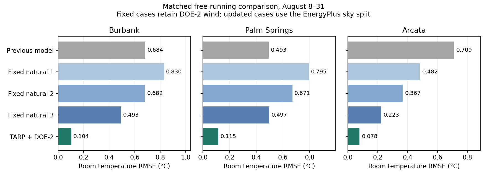

# Convection implementation and EnergyPlus comparison

TARP interior convection and DOE-2 exterior convection are implemented in the
production wall solver. Fixed coefficients and the former model remain available.
Sky treatment is a separate choice. The example defaults to the new convection
models; the matched benchmark explicitly selects the EnergyPlus sky split.

The correlations reproduce the earlier independent diagnostic. This verifies
implementation and agreement with another model, not accuracy against measurements.

## Room temperatures

RMSE in °C, pooled equally across four rooms, August 8–31:

| Model | Burbank | Palm Springs | Arcata |
|---|---:|---:|---:|
| Former convection and isotropic sky | 0.684 | 0.493 | 0.709 |
| Fixed natural h = 1 | 0.830 | 0.795 | 0.482 |
| Fixed natural h = 2 | 0.682 | 0.671 | 0.367 |
| Fixed natural h = 3 | 0.493 | 0.497 | 0.223 |
| TARP inside, DOE-2 outside | **0.104** | **0.115** | **0.078** |

Fixed cases change interior h and the exterior natural component together, in
W/m²K. They retain DOE-2 wind convection and the EnergyPlus sky split. These are
sensitivity cases, not confidence bounds. The former-model row includes both
its original convection and sky assumptions. Thus the before/after improvement
cannot be attributed to convection alone.

Keeping isotropic sky with the new convection gives 0.427°C in Burbank. Sky
assumptions still matter and have not been adjusted to compensate for convection.



## Surface heat flows and rain

Exterior convection RMSE in W/m², August 8–31, with the new correlations:

| Climate | Walls, all intervals | Roofs, all intervals | Walls, dry EP boundary | Roofs, dry EP boundary |
|---|---:|---:|---:|---:|
| Burbank | 0.541 | 0.669 | 0.541 | 0.669 |
| Palm Springs | 2.623 | 1.200 | 0.642 | 0.726 |
| Arcata | 3.860 | 3.368 | 0.515 | 0.747 |

The largest desert/coastal spikes are wet-surface boundary differences. EnergyPlus
switches exposed surfaces to wet-bulb air and h = 1000 W/m²K during rain. The
GraphBEM runs retain dry-surface convection. This occurs in five quarter-hour
intervals in Palm Springs and fifteen in Arcata, with none in Burbank. The saved
EP coefficients and temperatures confirm the switch; see
[wet boundary events](wet_boundary_events.csv) and the
[EnergyPlus source](https://github.com/NREL/EnergyPlus/blob/v22.2.0/src/EnergyPlus/HeatBalanceSurfaceManager.cc).

Rain wetting was not added to the production model in this change. The dry-boundary
columns exclude those surface intervals only. Thermal effects can persist afterward.
The room metrics above include the rain periods and their aftermath.

Dry-boundary exterior radiation RMSE ranges from 0.423 to 0.663 W/m² across
walls and roofs. Interior convection RMSE ranges from 0.066 to 0.478 W/m² across
surface categories. Full conduction, convection, radiation and temperature
metrics are in [surface_summary.csv](surface_summary.csv); conditional dry-face
metrics are in [dry_surface_summary.csv](dry_surface_summary.csv).

## Numerical checks and remaining limits

All 41 tests pass. Checks cover equilibrium, heating/cooling reversal, face
orientation, windward/leeward selection, a calm wind endpoint, ground separation,
wall/building energy conservation and timestep convergence. The production
correlations agree with the independent diagnostic in a coupled transient test.
The explicit legacy option also reproduced the pre-change solver exactly in a
119-step historical-driver check.

Refining Burbank from 60 s / 18 target cells to 30 s / 36 cells changes room
predictions by 0.0068°C RMS and at most 0.0232°C. Comparison RMSE changes from
0.1038 to 0.1026°C. Exterior roof conduction changes by 0.258 W/m² RMS, so
surface-flux discretization error is still material relative to the smallest
remaining differences. Whole-building energy residuals remain below 4.2e-7 W
including the refined run.

Warm-up repeats the first day until every wall-cell and room temperature changes
by less than 0.001 K. The new variable cases require 36, 42 and 33 days for
Burbank, Palm Springs and Arcata. EnergyPlus's warm-up state is unavailable.
Initialization sensitivity remains:

| New model RMSE, °C | Full month | Exclude 7 days | Exclude 14 days |
|---|---:|---:|---:|
| Burbank | 0.347 | 0.104 | 0.057 |
| Palm Springs | 0.404 | 0.115 | 0.062 |
| Arcata | 0.180 | 0.078 | 0.070 |

These windows also contain different weather, so they do not isolate initialization.
Remaining differences include enclosure-radiation approximations, constant air
properties, discretization and coupling timing. GraphBEM updates coefficients
from its previous substep surface temperature; EnergyPlus uses its own timestep
and iterative solution. No EnergyPlus thermal predictions enter GraphBEM forcing.

The input audit confirms identical geometry, zone volumes and constructions,
18°C ground surfaces, and no nominal gains/infiltration/ventilation in the three
saved cases. Each SQL has all 2,976 August quarter-hours. Its completion flags
are nevertheless false; the archived run status could not be verified from a
completion log. These are comparisons with the supplied output records, not new
EnergyPlus runs. See [case_audit.json](case_audit.json).

## Reproduction

From the repository root, using the graphBEM Python environment:

```sh
python scripts/audit_convection_cases.py --case-root /path/to/graphbem_cali
python scripts/run_convection_benchmarks.py --case-root /path/to/graphbem_cali --jobs 3
python scripts/summarize_convection_benchmarks.py
python -m unittest discover -s tests -q
```

There are sixteen new full-month runs. The Burbank former-model baseline is the
previously saved 60 s run. `summary.csv` contains pooled room metrics for all
three exclusion windows. Run directories retain inputs/provenance metadata,
warm-up histories, room histories and per-category surface metrics. Full surface
histories are reproducible and excluded from git.
